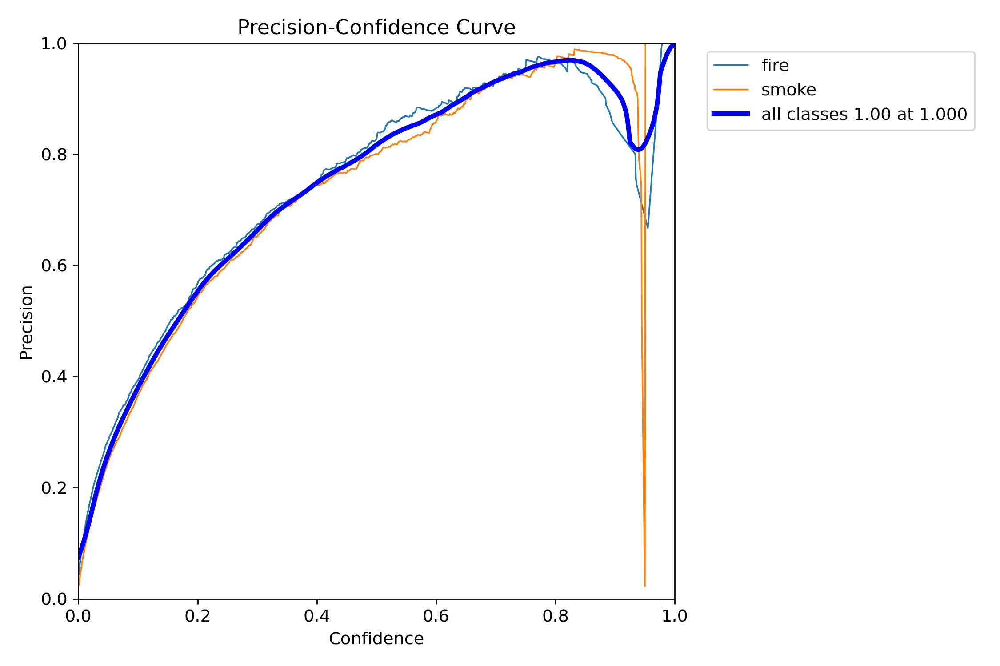
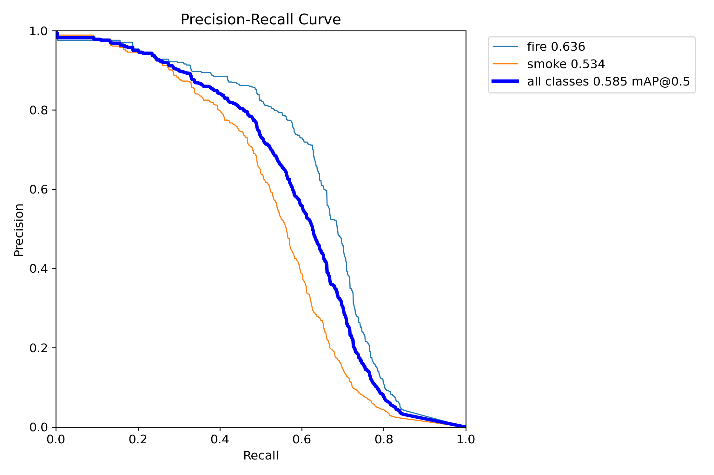
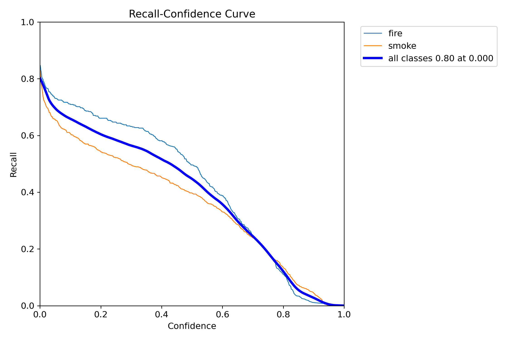
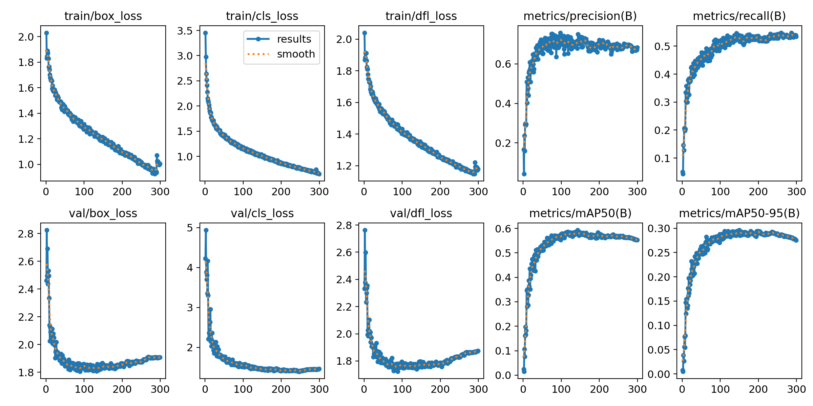
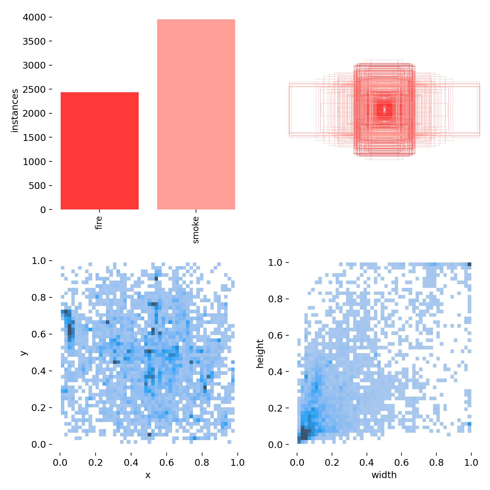

# FireDetection
A neural network that detects fire and smoke on images and videos

## Scripts definition
For training or combined predictions you can run [idk.py](idk.py).
For video prediction run [autotest.py](autotest.py). It will predict all videos in [Tests](Tests/) directory.
For custom source prediction run [test.py](test.py). You can select any links or paths for the videos.

# How to run
## Prerequisites
The script requires the following libraries for work (you could use `pip install` to install all of them):
* `ultralytics`
* `torch`
* `onnx`

## Steps
1. Clone the repo into any specified directory (it'll be named `$InstallPath/` below) using the following command: `git clone https://github.com/IOExcept10n/FireDetection.git`. If you encounter any problems with downloading, try Git LFS for cloning.
2. Let's test the model on any sample video (For example, [this one](https://www.youtube.com/watch?v=POZ4B2gPVmc)).
4. Run `test.py`
5. Input the following parameters:
```
Precision threshold: 0.25
Experiment name: SampleTest
Model name: best_m.pt
Source path: https://www.youtube.com/watch?v=POZ4B2gPVmc
```
Enjoy the result (it'll be stored in path `$InstallPath/runs/detect/SampleTest`)

## Metrics
**F1**
 </br>

**Precision**
 </br>

**Precision-Recall**
 </br>

**Recall**
 </br>

**Train results**
 </br>

**Labels**
 </br>
