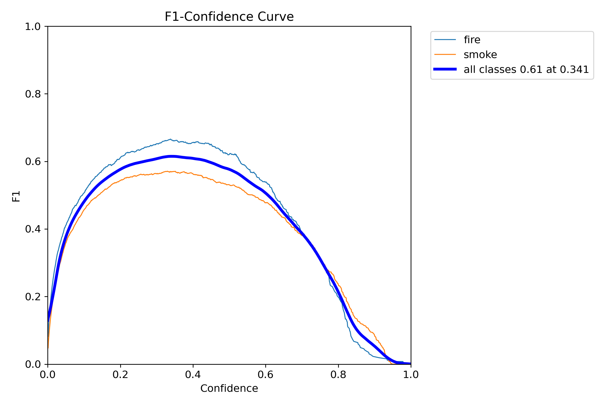

# FireDetection
A neural network that detects fire and smoke on images and videos

## How to run
For training or combined predictions you can run [idk.py](idk.py).
For video prediction run [test.py](test.py).

## Metrics
**F1**
  

**Precision**
  

**Precision-Recall**
  

**Recall**
  

**Train results**
  

**Labels**
  